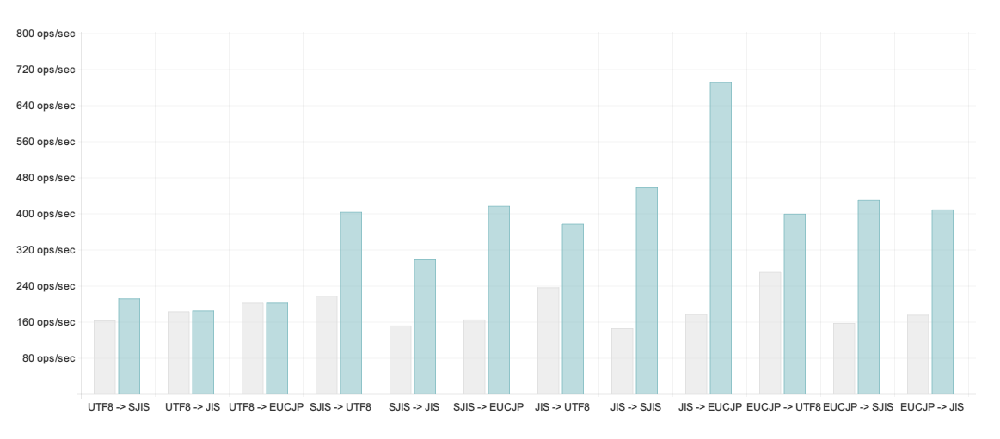

jconv
====================

> Pure Javascript Iconv for Japanese encodings.

[](https://travis-ci.org/narirou/jconv)

 * *Shift_JIS(CP932)、ISO-2022-JP(-1)、EUC-JP、UTF8* の相互変換を行うことが出来ます。
 * Javascriptのみで書かれているため、コンパイルは必要ありません。
 * [node-iconv](https://github.com/bnoordhuis/node-iconv)よりも高速です。

## インストール
```
npm install jconv
```

## 使い方
例えば **EUC-JP** から **Shift_JIS** に変換したい場合は、

```javascript
var jconv = require( 'jconv' );

var SJISBuffer = jconv.convert( EUCJPBuffer, 'EUCJP', 'SJIS' );
```

**iconv-lite** 形式のAPIも利用可能です。

```javascript
var string = jconv.decode( buffer, fromEncoding );

var buffer = jconv.encode( string, toEncoding );
```

## API
* **jconv( input, from, to )**  
* **jconv.convert( input, from, to )**  
    * `input` {Buffer} または {String}  
    * `from`, `to` {String}: 変換元のエンコードと、変換先のエンコードを指定します。  
    *Shift_JIS(SJIS)、ISO-2022-JP(JIS)、EUCJP、UTF8* のいずれかを指定してください。  
    * `return` {Buffer}  

* **jconv.decode( inputBuffer, from )**  
    * `return` {String}.  

* **jconv.encode( inputString, to )**  
    * `return` {Buffer}.  

## 速度
node-iconv@2.0.7 との変換速度の比較です。比較には、[夏目漱石 こころ](http://www.aozora.gr.jp/cards/000148/files/773_14560.html)
のテキストを用い [Benchmark.js](https://github.com/bestiejs/benchmark.js) を計測に利用しています。  
環境は *Windows7, core i5 2405-S, mem8G, Node 0.10.22*です。 (詳細が知りたい場合は、利用する環境で計測してみてください。)  
`グレー`がiconv、`青色`がjconvで、高い方がより高速です。  


[[latest log]](./test/chart/speedLog.txt)  
<!-- https://raw.github.com/narirou/jconv/master/ -->

## エンコードについて
 * Shift_JIS(CP932), ISO-2022-JP(-1), EUC-JP, UTF8の相互変換が可能です。  
   「秀丸エディタ」とほぼ同じ変換を行います。  

 * Windowsの機種依存文字も変換可能です。  
[(問題詳細)](http://support.microsoft.com/default.aspx?scid=kb;ja;JP170559)  

 * "JIS X 0208"、"JIS X 0212"、"CP932" には、ユニコード変換テーブルに相違点があります。
  そのため、いくつかの特殊な文字 ( ～￠￡∥ など ) では、デフォルトで相互変換を行うことが出来ません。  
 このモジュールでは、テーブルを修正して相互変換できるようにしていますが、
 定義に厳格な変換を行いたい場合は、 node-iconv に libiconv の日本語用修正パッチを当てたモジュールを用いることが推奨されます。  
[(問題詳細)](http://www8.plala.or.jp/tkubota1/unicode-symbols-map2.html)  

## 参考
 * [iconv-lite](https://github.com/ashtuchkin/iconv-lite) by ashtuchkin.
 * [Encoding.js](https://github.com/polygonplanet/Unzipper.js) by polygonplanet.
 * [iconv-js](https://github.com/Hikaru02/iconv-js) by Hikaru02.
 * [node-iconv](https://github.com/bnoordhuis/node-iconv) by bnoordhuis.
 * [libiconv-1.9.1-ja-patch Description](http://www2d.biglobe.ne.jp/~msyk/software/libiconv-1.9.1-patch.html)

ありがとうございます！

## TODO
 * native encoding support
